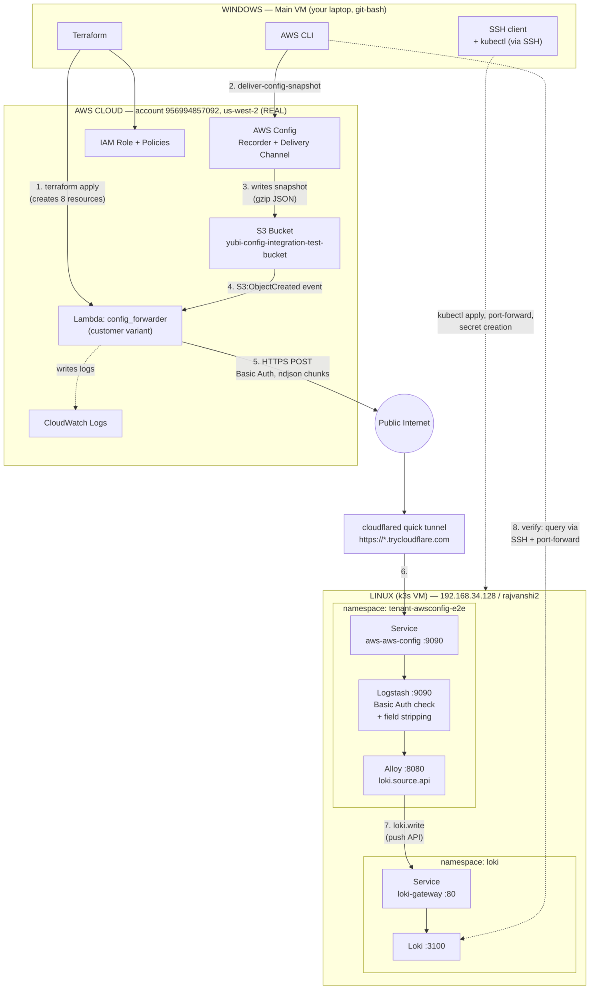

# AWS Config → SIEM: end-to-end validation guide

Step-by-step instructions to independently reproduce the full validation already run once (see
`AWS_CONFIG_E2E_TEST_WALKTHROUGH.md` for that run's narrative, bugs found, and fixes applied). This guide
assumes those fixes are already in the tree — `region` is now a **required** Terraform variable in both
`Integration_Guides/aws/aws-config/{customer,full}/`, `source_code_hash` is wired up so plain
`terraform apply` picks up code changes, and `lambda.py` no longer crashes on empty
`CHUNK_SIZE_LIMIT`/`LINE_LIMIT` or errors on AWS Config's writability-check file.

**What this proves, end to end**: real AWS Config → real S3 → real Lambda → real internet HTTPS → real
k3s pod running the actual (unmodified) collector manifests → real Loki. No shortcuts, no mocks, at any
stage.

**Nothing here touches production** — not the real SIEM cluster, not Vault, not any real tenant. Every
resource created (AWS or k3s) is disposable and torn down at the end.

## The two machines involved — read this first

This test spans **two separate machines**. Every command below is labeled with which one it runs on.
Mixing them up is the single easiest way to get confused, so the convention is:

| Label | Machine | What it is | How you reach it |
|---|---|---|---|
| 🖥️ **WINDOWS** | **Main VM** — your laptop/workstation | Where you run `terraform`, the `aws` CLI, and `git-bash` | You're already here |
| 🐧 **LINUX (k3s VM)** | **`192.168.34.128`**, hostname `rajvanshi2`, user `aditya` | Runs the actual k3s cluster (Loki + the collector pod) | `ssh -i ~/.ssh/ak_siem_k3s_test aditya@192.168.34.128` — from Windows |

A command shown as **WINDOWS** runs directly in your local git-bash shell. A command shown as
**LINUX (k3s VM)** is wrapped in an `ssh ... '...'` call — you still *type* it on Windows, but everything
inside the quotes executes on the remote Linux box. AWS itself is a third, separate place (the real
cloud account) — commands that talk to it (`aws ...`, `terraform ...`) run on **WINDOWS**, since that's
where your AWS CLI and Terraform are installed and authenticated.

---

## Architecture



**Reading the flow**: steps 1-2 (Terraform apply, forcing a snapshot) happen on **WINDOWS**, talking to
real **AWS**. Step 3-4 happen entirely inside AWS. Step 5 is the real Lambda posting out over the open
internet. Step 6 arrives at the **LINUX (k3s VM)** through the tunnel. Steps 7 stay entirely inside that
VM's k3s cluster. Step 8 (verification) is initiated from **WINDOWS** via SSH back into the VM.

---

## Part 0 — Reference values from the last run

Fill in your own where different. These are the values already proven to work.

| Item | Value |
|---|---|
| AWS account | `956994857092` |
| AWS region | `us-west-2` |
| Existing Config delivery bucket | `yubi-config-integration-test-bucket` |
| Existing Config delivery channel name | `default` |
| Existing Config key prefix | `AWSLogs/956994857092/Config/` |
| 🐧 LINUX (k3s VM) | `192.168.34.128`, user `aditya`, hostname `rajvanshi2` |
| 🖥️ WINDOWS (main VM) repo root | `c:\Users\adity\Desktop\ak-prod-siem` |

---

## Part 1 — Prerequisites checklist

**Machine: 🖥️ WINDOWS (main VM).** Confirm each of these before starting.

```bash
# AWS CLI configured and pointed at the right account
aws sts get-caller-identity
aws configure get region

# Terraform (already installed)
terraform -version

# kubectl client available locally (only used to talk to the VM's k3s if you don't SSH in for every command)
kubectl version --client

# SSH client available
ssh -V

# Docker (not strictly required for this path — only needed if you also want to run the
# Docker Compose "Level 1" pipeline-logic test described in the design docs before this)
docker --version
```

---

## Part 2 — One-time setup: SSH access to the k3s VM

**Machine: 🖥️ WINDOWS (main VM)** for all commands below — including the ones that start with `ssh`,
since that's where you type them. The `ssh aditya@...` command itself connects out to the
🐧 **LINUX (k3s VM)** and the `kubectl` calls inside the quotes execute there.

If you already have working SSH access to `192.168.34.128` (e.g. a prior key is still in
`~/.ssh/authorized_keys` there), skip to Part 3.

```bash
# Generate a dedicated key (don't reuse your main personal key for a throwaway test VM)
ssh-keygen -t ed25519 -f ~/.ssh/ak_siem_k3s_test -N "" -C "aws-config-e2e-validation"

# Print the public key
cat ~/.ssh/ak_siem_k3s_test.pub

# This installs the key ONTO the Linux VM, but you run it from Windows, and it will
# interactively prompt for the VM's password once:
ssh aditya@192.168.34.128 "mkdir -p ~/.ssh && chmod 700 ~/.ssh && echo '<paste-the-public-key-line-here>' >> ~/.ssh/authorized_keys && chmod 600 ~/.ssh/authorized_keys && echo DONE"

# Verify non-interactive access now works
ssh -o BatchMode=yes -i ~/.ssh/ak_siem_k3s_test aditya@192.168.34.128 "echo OK && hostname"
```

**Windows/git-bash gotcha**: any `aws` command with a path-like argument starting with `/` (e.g. a
CloudWatch log group name `/aws/lambda/...`) gets mangled by git-bash's automatic MSYS path conversion
(it tries to rewrite `/aws/...` as a Windows path). This only affects commands run on **WINDOWS** — prefix
those specific commands with `MSYS_NO_PATHCONV=1`, e.g.:

```bash
MSYS_NO_PATHCONV=1 aws logs tail "/aws/lambda/some-function-name" --region us-west-2 --since 5m
```

Confirm the 🐧 **LINUX (k3s VM)**'s k3s is healthy and its kubeconfig is readable without `sudo` (typed on
Windows, executes on Linux):

```bash
ssh -i ~/.ssh/ak_siem_k3s_test aditya@192.168.34.128 '
export KUBECONFIG=/etc/rancher/k3s/k3s.yaml
kubectl get nodes -o wide
ls -la /etc/rancher/k3s/k3s.yaml
'
```

Expect: one node, `STATUS Ready`. If the kubeconfig isn't world-readable (`-rw-------` owned by root
instead of `-rw-rw-rw-`), you'll need `sudo cat` and a password each time, or copy it out with `sudo` once
and adjust permissions — this run's VM happened to already have it world-readable.

---

## Part 3 — AWS-side discovery and safety checks (read-only)

**Machine: 🖥️ WINDOWS (main VM).** Talks directly to real AWS.

**Do this before creating anything.** These commands only read state; run them to confirm your existing
AWS Config setup and — critically — to check whether the target S3 bucket already has notification
configuration that a later Terraform apply could destroy.

```bash
REGION=us-west-2   # set to your actual region

# Find the existing recorder + delivery channel + target bucket
aws configservice describe-configuration-recorders --region "$REGION"
aws configservice describe-delivery-channels --region "$REGION"
aws configservice describe-configuration-recorder-status --region "$REGION"
```

Note the `s3BucketName` from the delivery channel output — that's your `bucket_name`/`bucket_arn` for
later. Then:

```bash
BUCKET="<bucket-name-from-above>"

# Confirm the bucket's actual region (must match what you set as `region` later — S3 event
# notifications can only invoke a Lambda in the SAME region as the bucket)
aws s3api get-bucket-location --bucket "$BUCKET"

# See what's actually in there, and what prefix AWS Config uses
aws s3 ls "s3://$BUCKET/" --recursive | head -30

# THE IMPORTANT ONE: check for existing notification config before you touch anything
aws s3api get-bucket-notification-configuration --bucket "$BUCKET"
```

**Stop and think if that last command returns anything non-empty.** Terraform's
`aws_s3_bucket_notification` resource *replaces* the bucket's entire notification configuration rather
than adding to it — if this bucket already has a CloudTrail (or anything else) Lambda trigger configured,
applying the AWS Config Terraform module as-is will silently delete it. If you see existing config there,
either use a different (dedicated) bucket for this test, or extend the Terraform module to merge
`lambda_function` blocks instead of letting it manage the whole notification resource. In the reference
run, this came back empty — safe to proceed.

Also record your account ID and the Config key prefix for later:

```bash
aws sts get-caller-identity --query Account --output text
# Prefix is typically: AWSLogs/<account-id>/Config/
```

---

## Part 4 — Deploy a local Loki backend on k3s

**Machine: file created on 🖥️ WINDOWS, copied to and applied on 🐧 LINUX (k3s VM).**

The collector needs somewhere real to write to. This Loki instance is test-only scaffolding — it is
**not** part of the repo, doesn't get committed, and mirrors nothing production-relevant except the
Service name/namespace, which is chosen to exactly match the real collector template's hardcoded
endpoint.

**(WINDOWS)** Create `loki-test-stack.yaml` locally:

```yaml
apiVersion: v1
kind: Namespace
metadata:
  name: loki
---
apiVersion: apps/v1
kind: Deployment
metadata:
  name: loki
  namespace: loki
spec:
  replicas: 1
  selector:
    matchLabels:
      app: loki
  template:
    metadata:
      labels:
        app: loki
    spec:
      containers:
      - name: loki
        image: grafana/loki:3.0.0
        args: ["-config.file=/etc/loki/local-config.yaml"]
        ports:
        - containerPort: 3100
        readinessProbe:
          httpGet:
            path: /ready
            port: 3100
          initialDelaySeconds: 5
          periodSeconds: 5
---
apiVersion: v1
kind: Service
metadata:
  # Matches templates/aws-config-collector-tpl's hardcoded endpoint exactly:
  # http://loki-gateway.loki.svc.cluster.local/loki/api/v1/push (no port in the URL = port 80)
  name: loki-gateway
  namespace: loki
spec:
  selector:
    app: loki
  ports:
  - port: 80
    targetPort: 3100
    name: http
```

Why the exact name/namespace/port matter: because they match the real (unmodified)
`templates/aws-config-collector-tpl/aws-external-secrets-cgf.yaml`'s `config.alloy` content, you don't
have to edit that file's Loki endpoint at all for this test — only the `{{ .username }}`/`{{ .password }}`
placeholders (see Part 5), exactly the substitution a real ExternalSecret would perform.

**(WINDOWS → copies to LINUX, then WINDOWS → SSH runs `kubectl` on LINUX):**

```bash
scp -i ~/.ssh/ak_siem_k3s_test loki-test-stack.yaml aditya@192.168.34.128:/home/aditya/

ssh -i ~/.ssh/ak_siem_k3s_test aditya@192.168.34.128 '
export KUBECONFIG=/etc/rancher/k3s/k3s.yaml
kubectl apply -f loki-test-stack.yaml
kubectl -n loki rollout status deployment/loki --timeout=120s
'
```

Expect: `deployment "loki" successfully rolled out`.

---

## Part 5 — Deploy the real collector manifests

**Machine: files rendered on 🖥️ WINDOWS, copied to and applied on 🐧 LINUX (k3s VM).**

This step deploys the **actual, unmodified** files from `templates/aws-config-collector-tpl/` — the same
manifests that would ship to a real tenant. Nothing here is test-specific except how the two Secrets
(normally managed by Vault + External Secrets Operator, neither of which exists on this throwaway
cluster) get created — by hand, with the same keys ESO would produce.

**(WINDOWS)** Choose test identifiers (or reuse the ones from the reference run — the namespace was
already deleted, so reusing is fine):

```bash
TENANT_ID="awsconfig-e2e"
INTEGRATION_ID="aws-config"
NAMESPACE="tenant-${TENANT_ID}"
```

**(WINDOWS)** Generate test Basic Auth credentials — these are what the real Lambda will send, and what
Logstash will check against. Keep them out of anything you commit.

```bash
TESTUSER="awsconfige2e"
TESTPASS=$(openssl rand -hex 12)
echo "Save these somewhere private for this test run: $TESTUSER / $TESTPASS"
```

**(WINDOWS)** Render `config.alloy` — the exact content from
`templates/aws-config-collector-tpl/aws-external-secrets-cgf.yaml`'s `data.config.alloy` block, with only
`{{ .username }}`/`{{ .password }}` substituted:

```bash
cat > config.alloy <<EOF
loki.source.api "raw_logs" {
  http {
    listen_address = "0.0.0.0"
    listen_port    = 8080
  }

  labels = {
    job = "awsconfig",
    cloud = "aws",
  }

  forward_to = [loki.write.loki_out.receiver]
}

loki.write "loki_out" {
  endpoint {
    url = "http://loki-gateway.loki.svc.cluster.local/loki/api/v1/push"
    basic_auth {
      username = "${TESTUSER}"
      password = "${TESTPASS}"
    }
  }
}
EOF
```

**(WINDOWS)** Render `pipeline.conf` — the exact content from
`templates/aws-config-collector-tpl/aws-logstash-config-external-secrets.yaml`'s `data.pipeline.conf`
block, same substitution. **These credentials are the ones that actually matter** — this is the real
authentication boundary the Lambda's HTTPS POST will cross later.

```bash
cat > pipeline.conf <<EOF
input {
  http {
    port => 9090
    type => "awsconfig"
    codec => json_lines
    user => "${TESTUSER}"
    password => "${TESTPASS}"
  }
  http {
    port => 9091
    type => "readiness"
  }
}

filter {
  if [type] == "readiness" {
    drop {}
  }

  json {
    source => "message"
  }

  if [type] == "awsconfig" {
    if [user_agent][original] and [user_agent][original] =~ /^kube-probe/ {
      drop { }
    }
    mutate {
      remove_field => [ "[@version]", "[headers]", "[host]", "[http]", "[url]" ]
    }
  }

  mutate {
    remove_field => [ "[event]", "[message]" ]
  }
}

output {
  http {
    url => "http://localhost:8080/loki/api/v1/raw"
    http_method => "post"
    format => "json"
    content_type => "application/json"
  }
}
EOF
```

**(WINDOWS)** Render the real `deployment.yaml`/`service.yaml` with the same placeholder substitution
`scripts/add_*.sh` would perform:

```bash
sed -e "s/<intergation_id>/${INTEGRATION_ID}/g" -e "s/<tenant_id>/${TENANT_ID}/g" \
  templates/aws-config-collector-tpl/deployment.yaml > deployment.yaml.rendered
sed -e "s/<intergation_id>/${INTEGRATION_ID}/g" -e "s/<tenant_id>/${TENANT_ID}/g" \
  templates/aws-config-collector-tpl/service.yaml > service.yaml.rendered
```

**(WINDOWS → copies to LINUX, then WINDOWS → SSH runs `kubectl` on LINUX)** Copy everything to the VM and
apply:

```bash
scp -i ~/.ssh/ak_siem_k3s_test config.alloy pipeline.conf deployment.yaml.rendered service.yaml.rendered \
  aditya@192.168.34.128:/home/aditya/

ssh -i ~/.ssh/ak_siem_k3s_test aditya@192.168.34.128 "
export KUBECONFIG=/etc/rancher/k3s/k3s.yaml

kubectl create namespace ${NAMESPACE} --dry-run=client -o yaml | kubectl apply -f -

# stand in for the two ExternalSecrets — same keys, hand-created, no Vault/ESO involved
kubectl create secret generic aws-alloy-${INTEGRATION_ID} \
  --namespace ${NAMESPACE} --from-file=config.alloy=./config.alloy \
  --dry-run=client -o yaml | kubectl apply -f -
kubectl create secret generic aws-logstash-${INTEGRATION_ID} \
  --namespace ${NAMESPACE} --from-file=pipeline.conf=./pipeline.conf \
  --dry-run=client -o yaml | kubectl apply -f -

kubectl apply -f deployment.yaml.rendered
kubectl apply -f service.yaml.rendered

kubectl -n ${NAMESPACE} rollout status deployment/aws-${INTEGRATION_ID} --timeout=280s
kubectl -n ${NAMESPACE} get pods -o wide
"
```

Expect: `deployment "aws-aws-config" successfully rolled out`, pod `2/2 Running`.

**First-run note**: pulling `grafana/alloy:v1.12.2` (~154 MB) and the custom Logstash image on a cold VM
took ~2.5 minutes combined in the reference run — not a config problem, just be patient. If your
`rollout status` command times out at 280s but `kubectl get pods` shows `ContainerCreating` with a
`Pulling image` event (not `ErrImagePull`/`ImagePullBackOff`), just re-run the `rollout status` command;
it isn't stuck.

---

## Part 6 — Level 2 validation: local sanity check (no internet exposure yet)

**Machine: 🐧 LINUX (k3s VM), via SSH from 🖥️ WINDOWS.** Entirely internal to the VM — nothing public yet.

Before exposing anything publicly, prove the pipeline works purely inside the VM.

```bash
ssh -i ~/.ssh/ak_siem_k3s_test aditya@192.168.34.128 "
export KUBECONFIG=/etc/rancher/k3s/k3s.yaml
nohup kubectl -n ${NAMESPACE} port-forward svc/aws-${INTEGRATION_ID} 9090:9090 > /tmp/portforward.log 2>&1 &
sleep 3
cat /tmp/portforward.log

echo '--- expect 401 (no auth) ---'
curl -s -o /dev/null -w '%{http_code}\n' -X POST http://localhost:9090/ \
  -H 'Content-Type: application/x-ndjson' --data-binary '{\"foo\":\"bar\"}'

echo '--- expect 200 (correct auth) ---'
curl -s -o /dev/null -w '%{http_code}\n' -X POST http://localhost:9090/ \
  -H 'Content-Type: application/x-ndjson' \
  -u '${TESTUSER}:${TESTPASS}' \
  --data-binary '{\"resourceType\":\"AWS::S3::Bucket\",\"resourceId\":\"sanity-check-bucket\",\"configurationItemStatus\":\"OK\",\"awsRegion\":\"${REGION}\"}'

sleep 2
echo '--- confirm it landed in Loki ---'
nohup kubectl -n loki port-forward svc/loki-gateway 3100:80 > /tmp/loki-pf.log 2>&1 &
sleep 3
curl -sG http://localhost:3100/loki/api/v1/query_range --data-urlencode 'query={job=\"awsconfig\"}' | head -c 1500
"
```

**Checkpoint**: first `curl` returns `401`, second returns `200`, and the Loki query returns a JSON
result containing your `sanity-check-bucket` record with `resourceType`/`resourceId`/`awsRegion` intact
and `@version`/`headers`/`host`/`http`/`url` **absent** (stripped by the pipeline's `mutate` filter). If
all three hold, **Level 2 is proven** — the real, unmodified manifests deploy correctly, auth enforces,
and field handling into Loki is correct. Everything past this point is proving the AWS side and the
public network path.

---

## Part 7 — Expose the collector publicly (cloudflared tunnel)

**Machine: install + run on 🐧 LINUX (k3s VM), via SSH from 🖥️ WINDOWS. Reachability check from
🖥️ WINDOWS.**

⚠️ **This opens a public, unauthenticated-by-Cloudflare HTTPS URL** to the collector pod for as long as
the tunnel runs — protected only by the collector's own Basic Auth (the same creds from Part 5). Keep
this window short and tear it down (Part 11) as soon as you're done.

**(LINUX, via SSH)** Install `cloudflared` on the VM (static binary, no root needed) if not already there:

```bash
ssh -i ~/.ssh/ak_siem_k3s_test aditya@192.168.34.128 '
mkdir -p ~/bin
curl -sL -o ~/bin/cloudflared https://github.com/cloudflare/cloudflared/releases/latest/download/cloudflared-linux-amd64
chmod +x ~/bin/cloudflared
~/bin/cloudflared --version
'
```

**(LINUX, via SSH)** Start the tunnel (uses the port-forward already running from Part 6):

```bash
ssh -i ~/.ssh/ak_siem_k3s_test aditya@192.168.34.128 '
nohup ~/bin/cloudflared tunnel --url http://localhost:9090 > /tmp/cloudflared.log 2>&1 &
sleep 8
grep -o "https://[a-zA-Z0-9.-]*\.trycloudflare\.com" /tmp/cloudflared.log | head -1
'
```

Copy the printed URL — this is your `target_url` for Terraform.

**(WINDOWS)** Verify it's actually reachable from *outside* the VM (simulating the path a real AWS
Lambda will take) before proceeding:

```bash
TUNNEL_URL="https://<whatever-was-printed>.trycloudflare.com"

curl -s -o /dev/null -w "external reachability check -> HTTP %{http_code}\n" -X POST "${TUNNEL_URL}/" \
  -H "Content-Type: application/x-ndjson" \
  -u "${TESTUSER}:${TESTPASS}" \
  --data-binary '{"resourceType":"AWS::S3::Bucket","resourceId":"external-tunnel-check","configurationItemStatus":"OK","awsRegion":"'"${REGION}"'"}'
```

Expect: `HTTP 200`.

---

## Part 8 — Terraform apply (customer variant) against real AWS

**Machine: 🖥️ WINDOWS (main VM).** Talks directly to real AWS — creates real, billable-if-left-running
resources (though idle Lambda/IAM/log-group costs are negligible).

Use the **customer** variant (`Integration_Guides/aws/aws-config/customer/`) since you already have an
AWS Config recorder + delivery channel (Part 3) — the **full** variant would try to create a second one
from scratch and is only for accounts that don't have Config enabled yet.

```bash
cd Integration_Guides/aws/aws-config/customer
```

Create `terraform.tfvars` (this file contains real credentials — **do not commit it**, it isn't gitignored
by name, only by the `.tfstate`/`.terraform/` patterns):

```bash
cat > terraform.tfvars <<EOF
username = "${TESTUSER}"
password = "${TESTPASS}"

target_url = "${TUNNEL_URL}/"

bucket_name = "${BUCKET}"
bucket_arn  = "arn:aws:s3:::${BUCKET}"
region      = "${REGION}"

config_key_prefix = "AWSLogs/$(aws sts get-caller-identity --query Account --output text)/Config/"

accuknox_suffix = "accuknox-awsconfig-e2e-test"
insecure_tls    = ""

lambda_memory_mb       = 512
lambda_timeout_seconds = 120
EOF
```

Initialize, plan, review, apply:

```bash
terraform init

terraform plan -var-file="terraform.tfvars" -out=e2e.tfplan
# READ THE PLAN. Expect: 8 to add, 0 to change, 0 to destroy —
# aws_lambda_function, aws_iam_role, 2x aws_iam_role_policy, aws_lambda_permission,
# aws_s3_bucket_notification, aws_cloudwatch_log_group, random_string.
# Double-check the region shown on each resource matches your bucket's actual region.

terraform apply "e2e.tfplan"
```

Expect: `Apply complete! Resources: 8 added, 0 changed, 0 destroyed.` and outputs
`lambda_function_name` / `lambda_role_arn`. Note the function name — you'll need it next.

```bash
LAMBDA_NAME=$(terraform output -raw lambda_function_name)
echo "$LAMBDA_NAME"
```

---

## Part 9 — Trigger a real AWS Config snapshot and verify the Lambda

**Machine: 🖥️ WINDOWS (main VM).** Talks directly to real AWS.

```bash
aws configservice deliver-config-snapshot --delivery-channel-name default --region "$REGION"
```

⚠️ **`DeliverConfigSnapshot` throttles on rapid repeat calls** (`ThrottlingException`) — if you need to
retry, wait **3–4 minutes** between calls. This isn't an issue in real operation, since production
deliveries aren't manually forced back-to-back.

Wait ~20-25 seconds for the S3 object to land and the Lambda to run, then check both:

```bash
# Confirm the snapshot object actually landed in S3
aws s3 ls "s3://${BUCKET}/AWSLogs/$(aws sts get-caller-identity --query Account --output text)/Config/${REGION}/" \
  --recursive --region "$REGION" | tail -5

# Tail the Lambda's logs (remember the MSYS_NO_PATHCONV=1 prefix on git-bash/Windows)
MSYS_NO_PATHCONV=1 aws logs tail "/aws/lambda/${LAMBDA_NAME}" --region "$REGION" --since 3m
```

**Checkpoint — expect to see, in order:**
```
[INFO] Loaded <N> configurationItems from AWSLogs/<account>/Config/.../ConfigSnapshot/....json.gz
[INFO] Successfully posted <bytes> bytes. Status: 200
[INFO] Successfully posted <bytes> bytes. Status: 200
...  (one line per chunk — large snapshots split into multiple HTTPS POSTs)
```

If you instead see `ValueError: invalid literal for int() with base 10: ''` — the `source_code_hash`/env
var fixes from the reference run aren't present in your checked-out `lambda.py`; check
`git status` / re-pull. If you see nothing at all after ~30s, check
`aws lambda get-policy --function-name "$LAMBDA_NAME" --region "$REGION"` — if that 404s
(`ResourceNotFoundException`), the Lambda's S3 invoke permission is missing (this can happen if you
force-replaced the Lambda resource for any reason — recreating the function wipes its resource policy);
`terraform apply -replace=aws_lambda_permission.s3_trigger_permission` fixes it.

---

## Part 10 — Confirm the data landed in Loki

**Machine: 🐧 LINUX (k3s VM), via SSH from 🖥️ WINDOWS.**

```bash
ssh -i ~/.ssh/ak_siem_k3s_test aditya@192.168.34.128 "
export KUBECONFIG=/etc/rancher/k3s/k3s.yaml
curl -sG http://localhost:3100/loki/api/v1/query_range \
  --data-urlencode 'query={job=\"awsconfig\"}' \
  --data-urlencode 'limit=5000' \
  | python3 -c \"
import json,sys
d=json.load(sys.stdin)
streams=d['data']['result']
total=sum(len(s['values']) for s in streams)
print('total log lines in loki for job=awsconfig:', total)
for s in streams[:1]:
    for v in s['values'][:3]:
        print(v[1][:300])
\"
"
```

(Requires the `loki-gateway` port-forward from Part 6 still running — if it died, re-run
`kubectl -n loki port-forward svc/loki-gateway 3100:80 &` first, on the **LINUX (k3s VM)**.)

**Checkpoint**: `total log lines` should roughly match the `configurationItems` count from the Lambda logs
in Part 9 (plus 1 if you also ran the Part 6 sanity check). Sample records should show real resource data
(`resourceType`, `resourceId`, `awsRegion`, etc.) with the stripped fields absent.

**If all of Parts 6, 9, and 10 check out, the full end-to-end chain is proven**: real AWS Config → real
S3 → real Lambda → real internet HTTPS with Basic Auth → real k3s manifests → real Loki.

---

## Part 11 — Teardown

Do this every time you finish a run — the tunnel is a live public URL and the AWS resources cost nothing
idle but shouldn't be left lying around regardless.

**(🖥️ WINDOWS)** Real AWS resources:

```bash
cd Integration_Guides/aws/aws-config/customer
terraform destroy -var-file="terraform.tfvars" -auto-approve
# Expect: Destroy complete! Resources: 8 destroyed.
```

**(🐧 LINUX (k3s VM), via SSH from Windows)** Tunnel + port-forwards on the VM:

```bash
ssh -i ~/.ssh/ak_siem_k3s_test aditya@192.168.34.128 '
pkill -f "[c]loudflared"
pkill -f "[k]ubectl.*port-forward"
'
```

**Gotcha**: use `pkill -f "[c]loudflared"` (with the brackets), not `pkill -f cloudflared`. Without the
bracket trick, `pkill -f` matches against the *full command line of every process*, including the very
shell running your `pkill` command itself (its command line literally contains the word "cloudflared" from
your own script text) — so a plain `pkill -f cloudflared` kills its own SSH session too, which is harmless
(the target process still dies) but makes the SSH command exit with code 255 and no further output. The
`[c]loudflared` regex trick means the *pattern* "cloudflared" no longer appears literally in your own
shell's command line (it's "[c]loudflared" there), so it can't self-match.

**(🐧 LINUX (k3s VM), via SSH from Windows)** k3s test resources on the VM:

```bash
ssh -i ~/.ssh/ak_siem_k3s_test aditya@192.168.34.128 '
export KUBECONFIG=/etc/rancher/k3s/k3s.yaml
kubectl delete namespace tenant-awsconfig-e2e --wait=false
kubectl delete namespace loki --wait=false
'
```

**(🖥️ WINDOWS)** Local cleanup (secrets/state — none of this should be committed):

```bash
cd Integration_Guides/aws/aws-config/customer
rm -f terraform.tfvars e2e.tfplan lambda_payload.zip terraform.tfstate*
rm -rf .terraform .terraform.lock.hcl
cd -   # back to repo root
rm -f config.alloy pipeline.conf deployment.yaml.rendered service.yaml.rendered

# Confirm nothing sensitive is left tracked/untracked that shouldn't be
git status --short
```

---

## Part 12 — Troubleshooting reference (issues actually hit in the last run)

| Symptom | Machine | Cause | Fix |
|---|---|---|---|
| `int() with base 10: ''` in Lambda logs | AWS (Lambda) | Old `lambda.py` without the empty-env-var fix | Confirm `git status`/file contents match the fixed version — `os.environ.get("CHUNK_SIZE_LIMIT") or 3*1024*1024`, not `os.environ.get("CHUNK_SIZE_LIMIT", 3*1024*1024)` |
| `terraform apply` after editing `lambda.py` says "No changes" | 🖥️ Windows | Missing `source_code_hash` on the Lambda resource | Confirm `main.tf` has `source_code_hash = data.archive_file.lambda_zip.output_base64sha256` — already fixed in the tree this guide assumes |
| `aws lambda get-policy` returns `ResourceNotFoundException` after a Lambda replace | 🖥️ Windows / AWS | Destroying/recreating a Lambda function wipes its resource-based policy; the `aws_lambda_permission` Terraform resource doesn't self-heal | `terraform apply -replace=aws_lambda_permission.s3_trigger_permission` |
| `ThrottlingException` on `deliver-config-snapshot` | 🖥️ Windows / AWS | AWS Config rate-limits forced deliveries | Wait 3-4 minutes between manual triggers |
| `aws logs ...` / `aws s3api ... --bucket` commands fail with a weird path-mangling error | 🖥️ Windows (git-bash only) | MSYS auto-converts leading-`/` arguments to Windows paths | Prefix the command with `MSYS_NO_PATHCONV=1` |
| SSH command exits 255 right after a `pkill -f <name>` | 🐧 Linux (k3s VM) | `pkill -f` self-matched the invoking shell's own command line | Use the `[x]xxx` bracket trick: `pkill -f "[c]loudflared"` |
| Collector pod stuck `ContainerCreating` for minutes | 🐧 Linux (k3s VM) | Cold image pull (Alloy ~154 MB + custom Logstash image) on first deploy | Normal — check `kubectl describe pod` for `Pulling image` (fine) vs. `ImagePullBackOff` (not fine); just wait or re-run `rollout status` |
| Terraform plan shows the wrong region on every resource | 🖥️ Windows | `region` var not set, or set to the wrong value in `terraform.tfvars` | It's a required variable with no default specifically so this can't be silently wrong — set it explicitly to match the bucket's actual region from Part 3 |
| `aws s3api get-bucket-notification-configuration` returns existing config before you've applied anything | 🖥️ Windows / AWS | The bucket is shared with another trigger (e.g. CloudTrail) | **Do not proceed as-is** — `aws_s3_bucket_notification` will replace, not merge, the bucket's notification config. Use a different bucket, or extend the module. |

---

## Part 13 — What "success" looks like, summarized

- [ ] Part 3 (Windows/AWS): bucket notification check came back empty (or you've accounted for what's there)
- [ ] Part 5 (Linux k3s VM): collector pod `2/2 Running`
- [ ] Part 6 (Linux k3s VM): `401` without auth, `200` with auth, sanity record visible in Loki with fields stripped correctly
- [ ] Part 7 (Linux tunnel, verified from Windows): tunnel URL reachable with `200` from outside the VM
- [ ] Part 8 (Windows/AWS): `terraform apply` → 8 resources added, 0 destroyed
- [ ] Part 9 (Windows/AWS): Lambda logs show `Loaded N configurationItems` and one or more `Status: 200` lines, no `[ERROR]`
- [ ] Part 10 (Linux k3s VM, checked from Windows): Loki query shows the real configurationItems count landed, fields intact and stripped correctly
- [ ] Part 11 (both machines): `terraform destroy` → 8 destroyed; tunnel, port-forwards, and k3s namespaces cleaned up; `git status --short` shows no leftover secrets
